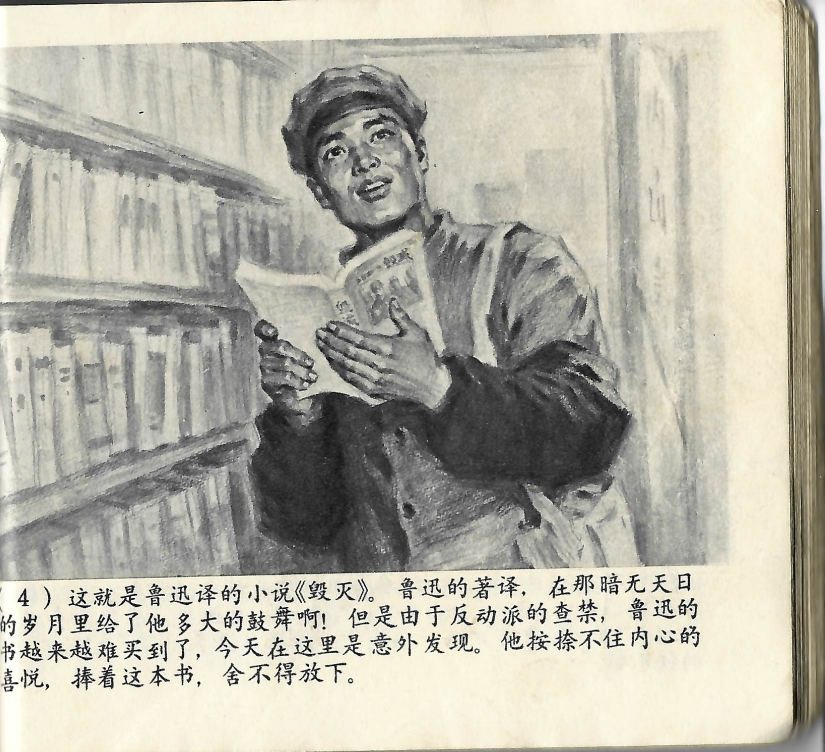



这就是鲁迅译的小说《毁灭》。鲁迅的著译，在那暗无天日的岁月里给了他多大的鼓舞啊！但是由于反动派的查禁，鲁迅的书越来越难买到了，今天在这里是意外发现。他按捺不住内心的喜悦，捧着这本书，舍不得放下。

<--->

Es war eben jener von Lu Xun übersetzte Roman *Die Neunzehn*. Was für eine enorme Inspiration Lu Xuns Schriften und Übersetzungen ihm in jenen finsteren Zeiten doch gegeben hatten! Doch aufgrund der Verbote durch die reaktionären Kräfte wurde es immer schwieriger, Lu Xuns Bücher zu erwerben. Dass er nun heute hier auf dieses Werk stieß, war ein unverhoffter Fund. Er konnte seine innere Freude nicht zurückhalten, hielt das Buch in den Händen und konnte es nicht mehr aus den Händen legen.

