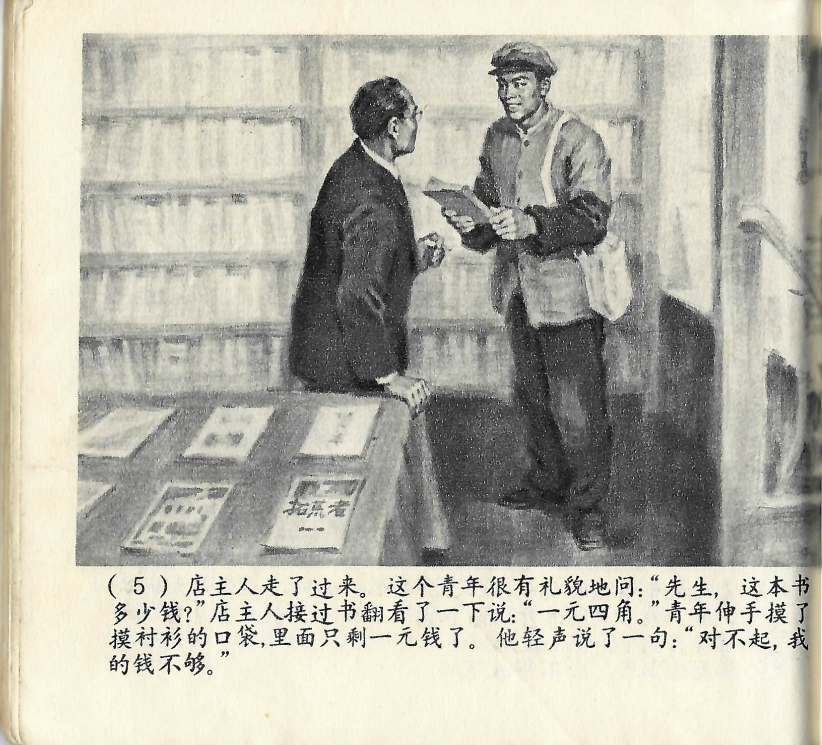



店主人走了过来。这个青年很有礼貌地问：“先生，这本书多少钱？”店主人接过书翻看了一下说：“一元四角。”青年伸手摸了摸衬衫的口袋，里面只剩一元钱了。他轻声说了一句：“对不起，我的钱不够。”

<--->

Der Ladenbesitzer kam zu ihm herüber. Der junge Mann fragte höflich: „Entschuldigen Sie, wieviel kostet dieses Buch?" Der Ladenbesitzer nahm das Buch, drehte es um und sagte: „Einen Yuan und vier Jiao." Der junge Mann griff in seine Hemdtasche und merkte, dass er nur noch einen Yuan übrighatte. Er sagte mit leiser Stimme: „Es tut mir leid, doch mein Geld reicht nicht aus."

