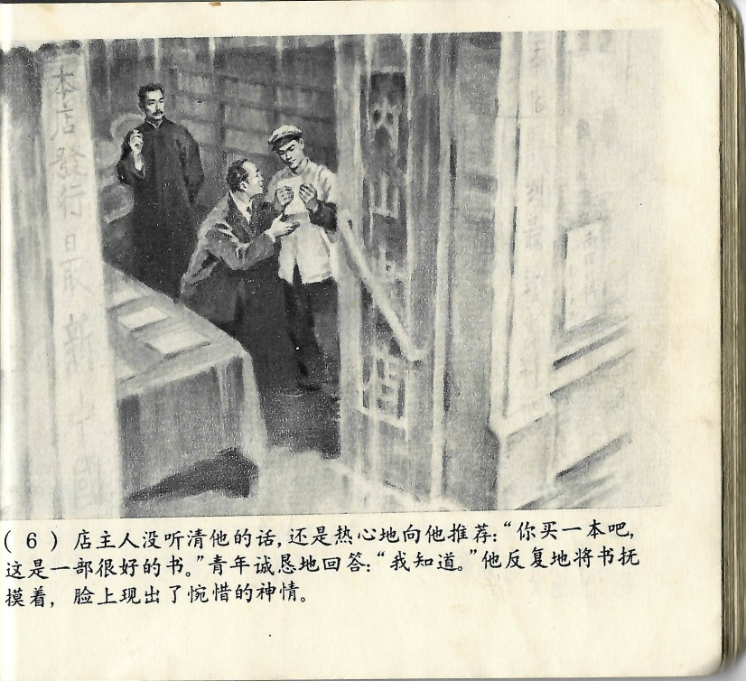



店主人没听清他的话，还是热心地向他推荐：“你买一本吧，这是一部很好的书。”青年诚恳地回答：“我知道。”他反复地将书抚摸着，脸上现出了惋惜的神情。

<--->

Der Ladenbesitzer hatte ihn nicht richtig gehört und empfahl ihm weiter enthusiastisch: „Kaufen Sie ein Exemplar, das ist ein wirklich gutes Buch." Der junge Mann erwiderte aufrichtig: „Ich weiß." Er fuhr immer wieder mit den Fingern über das Buch, sein Gesichtsausdruck von Bedauern erfüllt.

