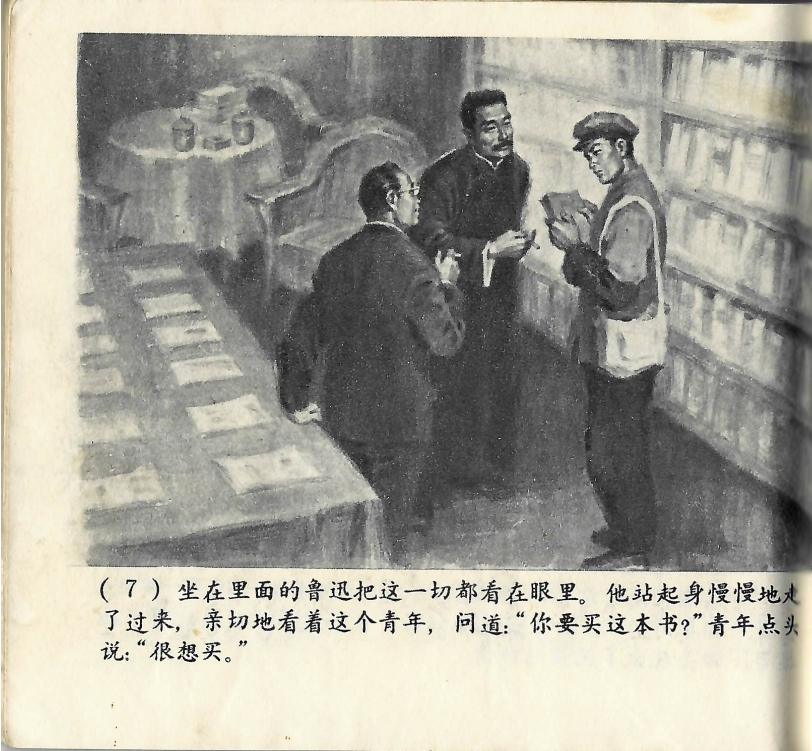



坐在里面的鲁迅把这一切都看在眼里。他站起身慢慢地走了过来，亲切地看着这个青年，问道：“你要买这本书？”青年点头说：“很想买。”

<--->

Lu Xun saß derweil im Inneren des Ladens und hatte dies alles mit angesehen. Jetzt stand er auf, ging langsam hinüber, sah den jungen Mann freundlich an und fragte: „Möchten Sie das Buch kaufen?" Der junge Mann nickte und antwortete: „Sehr gerne."

