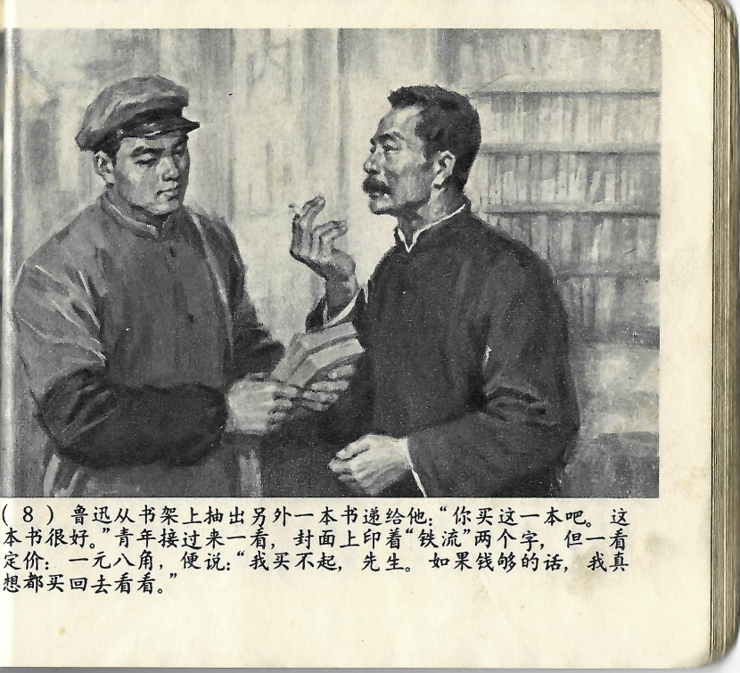



鲁迅从书架上抽出另一本书递给他：“你买这一本吧，这本书很好。”青年接过来一看，封面上印着“铁流”两个字，但一看定价：一元八角，便说：“我买不起，先生。如果钱够的话，我真想都买回去看看。”

<--->

Lu Xun zog ein weiteres Buch aus dem Bücherregal und reichte es ihm: „Kaufen Sie doch dieses Buch. Es ist sehr gut." Der junge Mann nahm es entgegen und warf einen Blick auf den Einband, auf dem der Titel *Der eiserne Strom* aufgedruckt war. Doch als er den Preis von einem Yuan und acht Jiao sah, sagte er: „Das kann ich mir nicht leisten, lieber Herr. Wenn ich genug Geld hätte, würde ich wirklich gerne beide Bücher mitnehmen und lesen."

