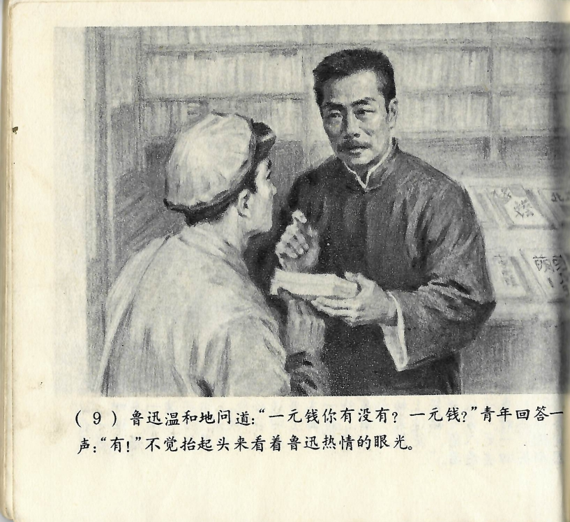



鲁迅温和地问道：“一元钱你有没有？一元钱？”青年回答一声：“有！”不觉抬起头来看着鲁迅热情的眼光。

<--->

Lu Xun fragte gutmütig: „Hast du denn einen Yuan? Einen einzigen?" Der junge Mann antwortete: „Ja!" Unbewusst hob er den Kopf und schaute in Lu Xuns freundliche Augen.

