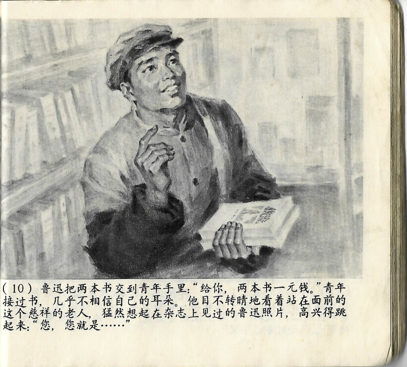



鲁迅把两本书交到青年手里：“给你，两本书一元钱。”青年接过书，几乎不相信自己的耳朵，他目不转睛地看着站在面前的这个慈祥的老人，猛然想起在杂志上见过的鲁迅照片，高兴得\[sic\]跳起来：“您，您就是……”

<--->

Lu Xun legte beide Bücher in die Hände des jungen Mannes: „Hier, zwei Bücher für einen Yuan." Der junge Mann nahm die Bücher entgegen und konnte seinen Ohren kaum trauen. Unverwandt blickte er den gütigen alten Mann an, der vor ihm stand. Plötzlich erinnerte er sich an ein Foto von Lu Xun, das er in einer Zeitschrift gesehen hatte. Er sprang fröhlich auf: „Sie, Sie sind doch..."

