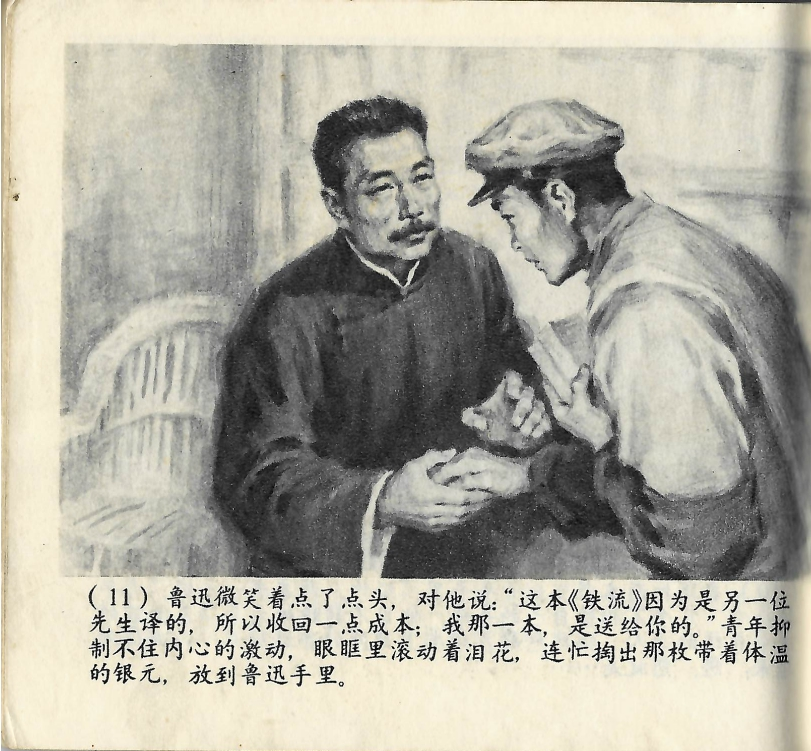



鲁迅微笑着点了点头，对他说：“这本《铁流》因为是另一位先生翻译的，所以收回一点成本；我那一本，是送给你的。”青年抑制不住内心的激动，眼眶里滚动着泪花，连忙掏出那枚带着体温的银元，放到鲁迅手里。

<--->

Lu Xun nickte lächelnd und sagte zu ihm: „Dieses Buch *Der eiserne Strom* hat ein anderer Herr übersetzt, daher muss ich von dir einen Teil der Kosten dafür einziehen. Das von mir übersetzte Buch aber schenke ich dir." Der junge Mann konnte seine innere Aufregung nicht mehr verbergen, sodass ihm Tränen in die Augen stiegen. Eilig zog er die Silbermünze, die noch seine Körperwärme trug, heraus und legte sie Lu Xun in die Hand.

