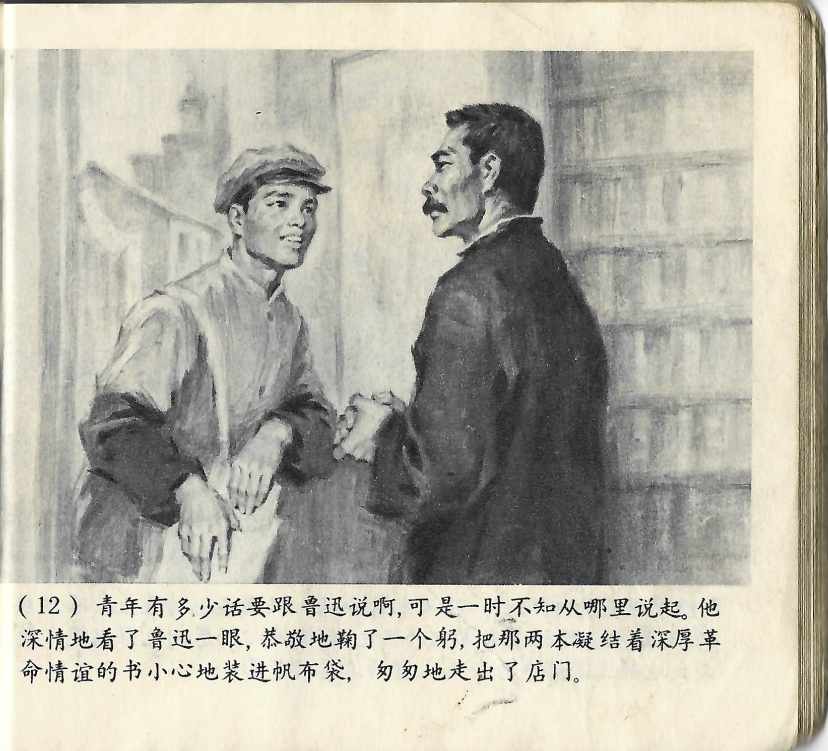



青年有多少话要跟鲁迅说啊，可是一时不知从哪里说起。他深情地看了鲁迅一眼，恭敬地鞠了一个躬，把那两本凝结着深厚革命情谊的书小心地装进帆布袋，匆匆地走出了店门。

<--->

Der junge Mann wollte Lu Xun so viel sagen, doch in dem Moment wusste er nicht, wo er anfangen sollte. Er schaute Lu Xun mit tiefer Zuneigung an, verbeugte sich respektvoll, steckte die beiden Bücher, die von einer tiefen revolutionären Freundschaft zeugten, vorsichtig in seine Leinentasche und verließ schnellen Schrittes den Laden.

