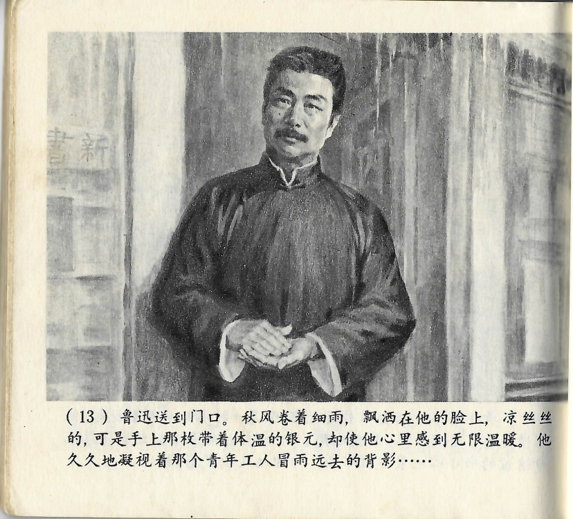



鲁迅送到门口。秋风卷着细雨，飘洒在他的脸上，凉丝丝的，可是手上那枚带着体温的银元，却使他心里感到无限温暖。他久久地凝视着那个青年工人冒雨远去的背影……

<--->

Lu Xun begleitete ihn bis zur Tür. Durch den Herbstwind wehte ihm der Nieselregen ins Gesicht. Es war kühl, doch die noch warme Silbermünze in seiner Hand erfüllte sein Herz mit grenzenloser Wärme. Lange blickte er dem jungen Arbeiter hinterher, wie er im Regen verschwand...

