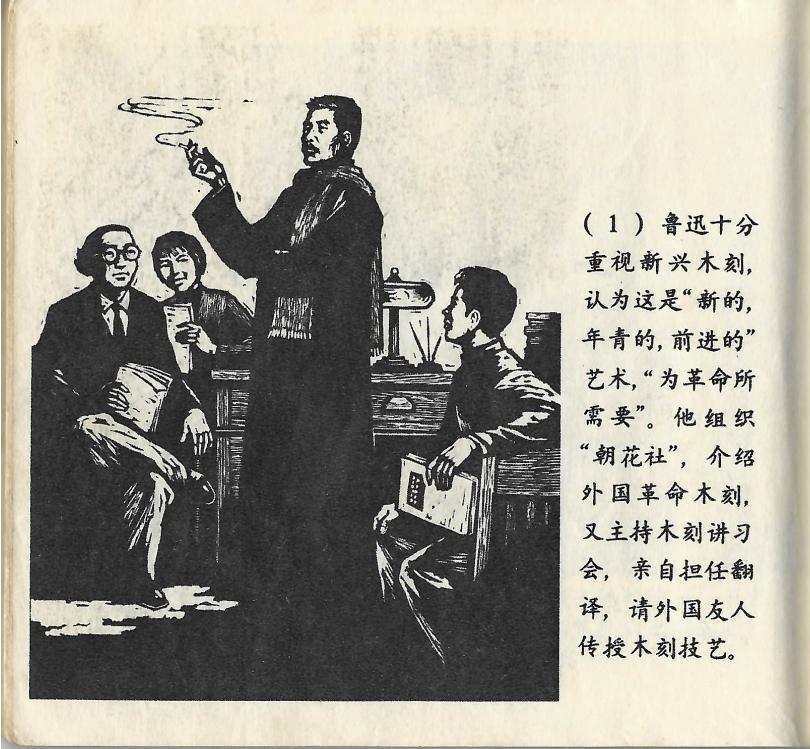



鲁迅十分重视新兴木刻，认为这是“新的，年轻的，前进的”艺术，“为革命所需要”。他组织“朝花社”，介绍外国革命木刻，又主持木刻讲习会，亲自担任翻译，请外国友人传授木刻技艺。

<--->

Lu Xun schätzte die neu aufkommende Holzschnittkunst sehr, er betrachtete sie als „neue, junge und fortschrittliche“ Kunstform „für die Revolution“. Er organisierte die „Morgenblüten-Gesellschaft“, machte revolutionäre Holzschnitte aus dem Ausland bekannt und richtete außerdem ein Seminar über Holzschnitte aus. Dort war er persönlich als Übersetzer tätig und lud einen befreundeten ausländischen Künstler ein, seine Fertigkeiten in der Holzschnittkunst weiterzugeben. 

