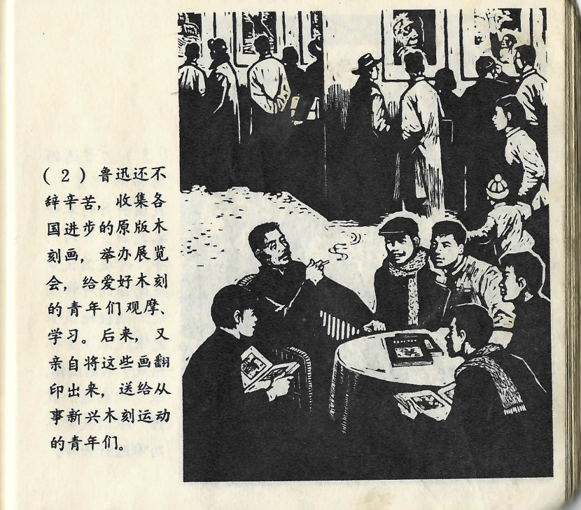



鲁迅还不辞辛苦，收集各国进步的原版木刻画，举办展览会，给爱好木刻的青年们观摩、学习。后来，又亲自将这些画翻印出来，送给从事新兴木刻运动的青年们。

<--->

Lu Xun scheute auch sonst keine Mühen, er sammelte aus verschiedensten Ländern fortschrittliche Holzschnitte im Original und veranstaltete Ausstellungen, um jungen Menschen, die sich für den Holzschnitt begeisterten, Anschauungsmaterial zu bieten und davon zu lernen. Später ließ er diese Bilder persönlich reproduzieren und schenkte sie den jungen Leuten, die sich in der aufkeimenden Holzschnitt-Bewegung engagierten.

