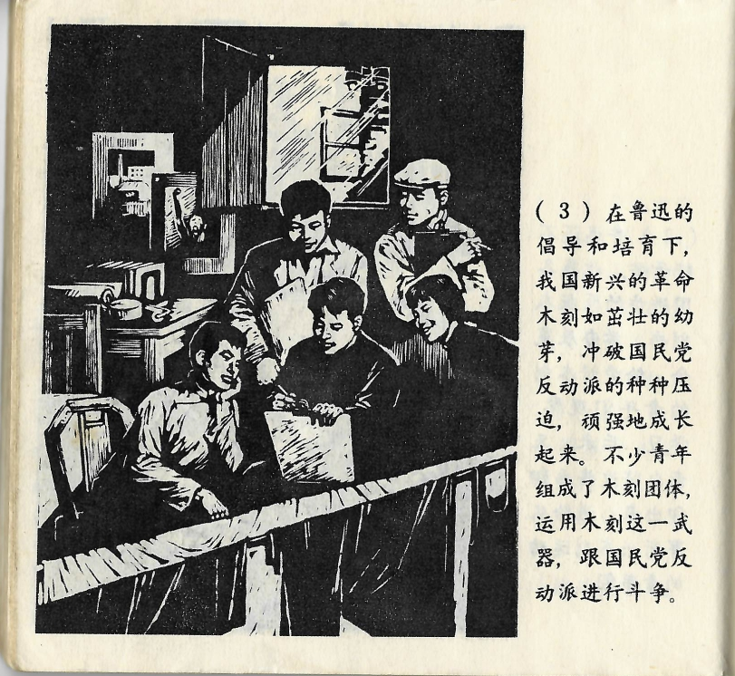



在鲁迅的倡导和培育下，我国新兴的革命木刻如茁壮的幼芽，冲破国民党反动派的种种压迫，顽强地成长起来。不少青年组成了木刻团体，运用木刻这一武器，跟国民党反动派进京斗争。

<--->

Durch Lu Xuns Initiative und Anleitung glich Chinas aufkeimender revolutionärer Holzschnitt einem kräftigen Sprössling, der jede Unterdrückung durch die Reaktionäre der Guomindang überwindet und unbeugsam wächst. Viele junge Menschen bildeten Holzschnitt-Gruppen und benutzten den Holzschnitt als Waffe im Kampf gegen die Reaktionäre der Guomindang.

