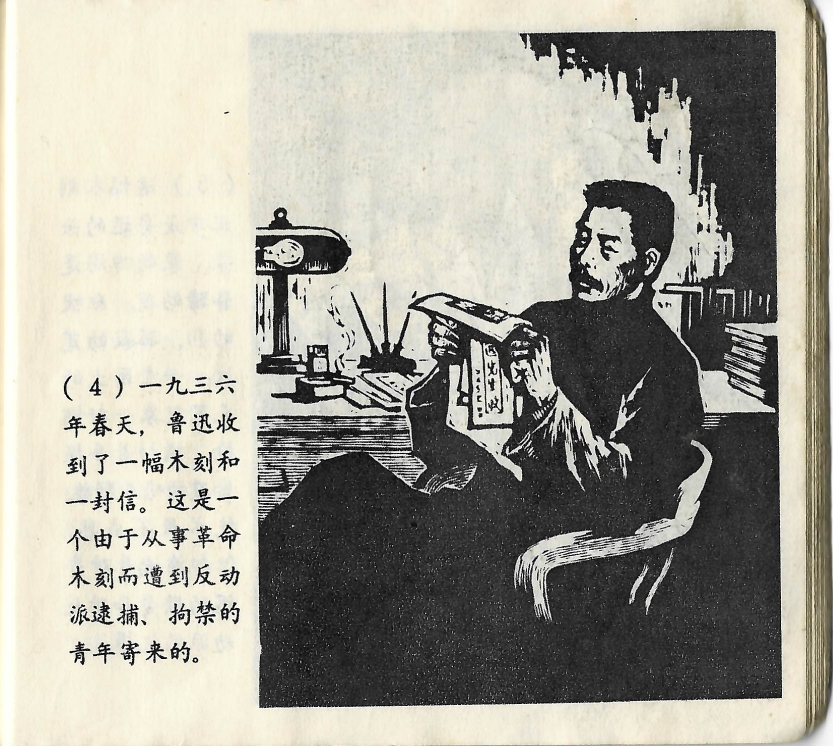



一九三六年春天，鲁迅收到了一幅木刻和一封信。这是一个由于从事革命木刻而遭到反动派逮捕、拘禁的青年寄来的。

<--->

Im Frühjahr 1936 erhielt Lu Xun einen Holzschnitt und einen Brief. Geschickt wurden sie ihm von einem jungen Mann, der sich dem revolutionären Holzschnitt widmete und aus diesem Grund von den Reaktionären festgenommen und eingesperrt worden war.

