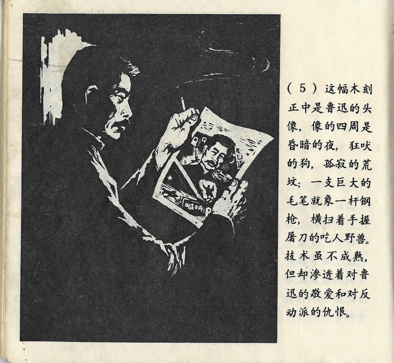



这副木刻正中是鲁迅的头像，像的四周是昏暗的夜，狂吠的狗，孤寂的荒坟；一支巨大的毛笔就象[sic]一杆钢枪，横扫着手握屠刀的吃人野兽。技术虽不成熟，但却渗透着对鲁迅的敬爱和对反动派的仇恨。

<--->

Im Zentrum des Holzschnitts befand sich ein Porträt von Lu Xun. Es war umgeben von düsterer Nacht, wild bellenden Hunden und einsamen, verlassenen Gräbern; ein riesengroßer Pinsel, der einem Gewehr glich, fegte eine menschenfressende Bestie, die ein Schlachtmesser in der Hand hielt, davon. Zwar war die Technik noch nicht ausgereift, doch war das Bild voller Respekt und Liebe für Lu Xun und voller Verachtung gegenüber den Reaktionären.

