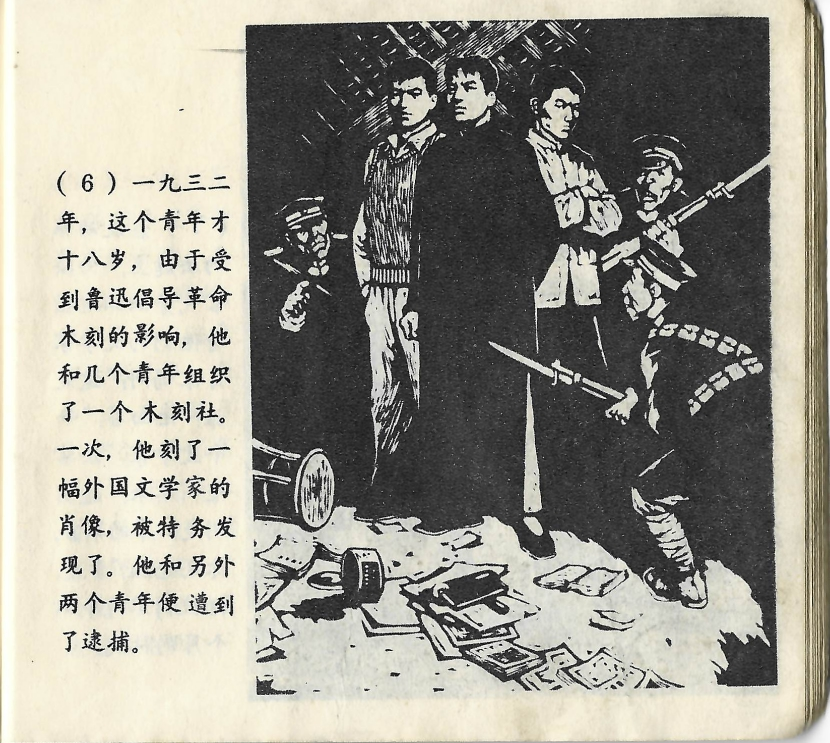



一九三二年，这个青年才十八岁，由于受到鲁迅倡导革命木刻的影响，他和几个青年组织了一个木刻社。一次，他刻了一幅外国文学家的肖像，被特务发现了。他和另外两个青年便遭到了逮捕。

<--->

Im Jahr 1932, als der junge Mann gerade erst achtzehn Jahre alt gewesen war, hatte er unter dem Einfluss von Lu Xuns Initiative für den revolutionären Holzschnitt mit einigen anderen jungen Leuten eine Gesellschaft für auf die Beine gestellt. Einmal hatte er das Porträt eines ausländischen Schriftstellers geschnitzt, was von einem Spitzel entdeckt wurde. Er und zwei weitere junge Leute waren daraufhin festgenommen worden.

