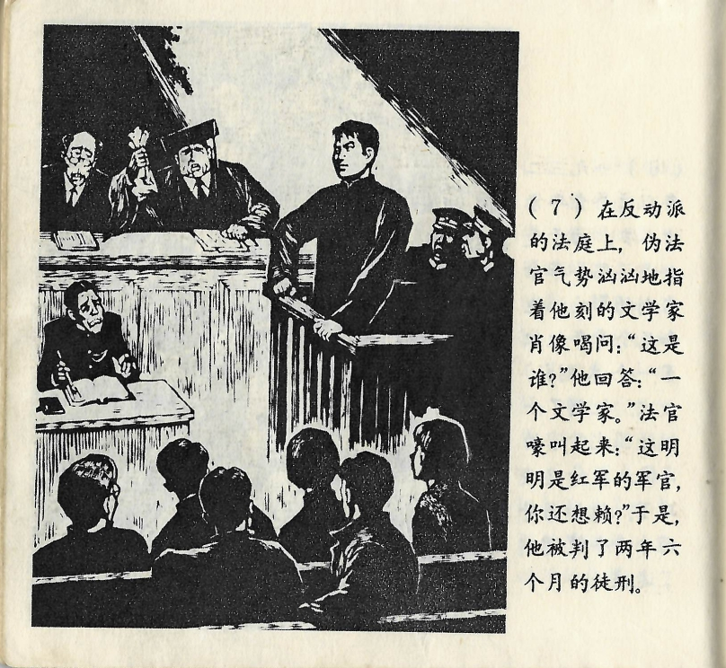



在反动派的法庭上，伪法官气势汹汹地指着他刻的文学家肖像喝问：“这是谁？”他回答：“一个文学家。”法官嚎叫起来：“这明明是红军的军官，你还想赖？”于是，他被判了两年六个月的徒刑。

<--->

Im Jahr 1932, als der junge Mann gerade erst achtzehn Jahre alt gewesen war, hatte er unter dem Einfluss von Lu Xuns Initiative für den revolutionären Holzschnitt mit einigen anderen jungen Leuten eine Gesellschaft für auf die Beine gestellt. Einmal hatte er das Porträt eines ausländischen Schriftstellers geschnitzt, was von einem Spitzel entdeckt wurde. Er und zwei weitere junge Leute waren daraufhin festgenommen worden.

