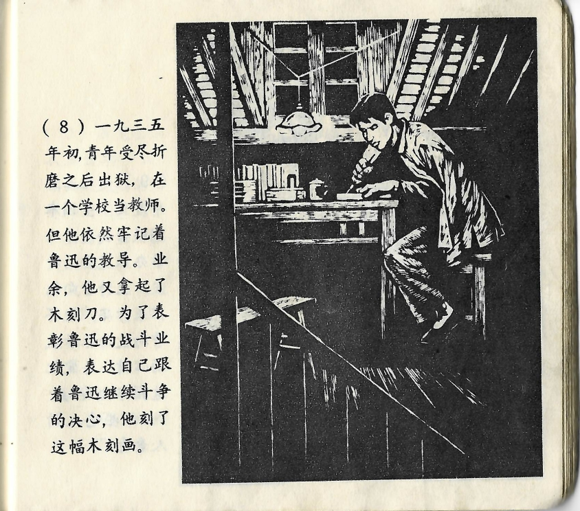



一九三五年初，青年受尽折磨之后出狱，在一个学校当教师。但他依然牢记着鲁迅的教导。业余，他又拿起了木刻刀。为了表彰鲁迅的战斗业绩，表达自己跟着鲁迅继续斗争的决心，他刻了这副木刻画。

<--->

Zu Beginn des Jahres 1935 war der junge Mann dann, nachdem er nach einem qualvollen Gefängnisaufenthalt entlassen worden war, Lehrer an einer Schule geworden. Aber er hatte sich immer noch ganz genau an Lu Xuns Unterweisungen erinnert. In seiner Freizeit nahm er wieder das Schnitzmesser zur Hand. Um die Erfolge von Lu Xuns Kampf zu ehren und seine eigene Entschlossenheit auszudrücken, dessen Kampf fortzusetzen, hatte er diesen Holzschnitt angefertigt.

