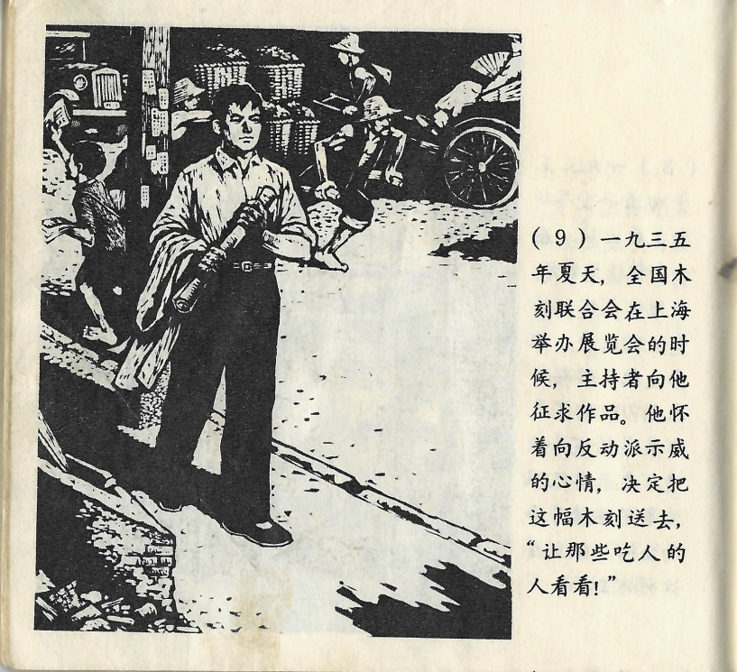



一九三五年夏天，全国木刻联合会在上海举办展览会的时候，主持者向他征求作品。他怀着向反动派示威的心情，决定把这副木刻送去，“让那些吃人的人看看！”

<--->

Im Sommer 1935, als die Nationale Holzschnitt-Vereinigung in Shanghai eine Ausstellung veranstaltete, hatten ihn die Veranstalter nach einem seiner Werke gefragt. Mit dem Gedanken daran, gegen die Reaktionäre zu protestieren, beschloss er, jenen Holzschnitt einzureichen, „um es diesen Menschenfressern zu zeigen!“

