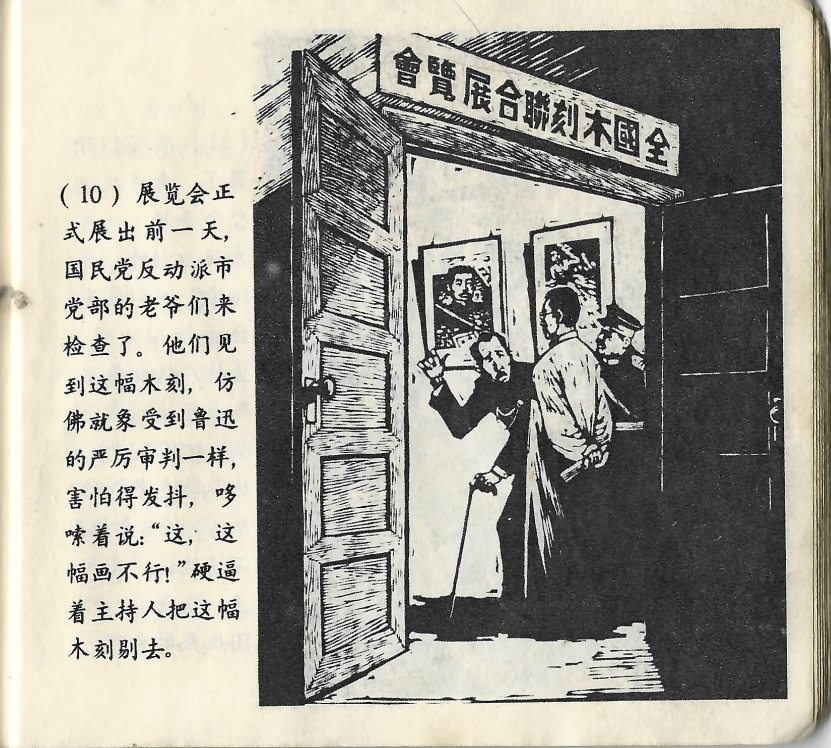



展览会正式展出前一天，国民党反动派市党部的老爷们来检查了。他们见到这幅木刻，仿佛就象\[sic\]受到鲁迅的严厉审判一样，害怕得\[sic\]发抖，哆嗦着说：“这，这幅画不行！”硬逼着主持人把这幅木刻剔去。

<--->

Einen Tag vor der offiziellen Eröffnung der Ausstellung kamen die Herrschaften vom städtischen Parteibüro der reaktionären Guomindang zur Inspektion der Ausstellungsstücke. Als sie den Holzschnitt sahen, erschauderten sie vor Angst, als empfingen sie das strenge Urteil von Lu Xun, und sagten zitternd: „Dieses da, dieses Bild geht nicht!" Und so zwangen sie die Veranstalter, das Bild wieder abzuhängen.

