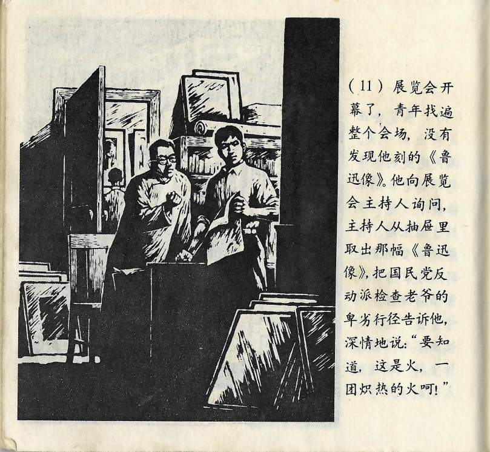



展览会开幕了，青年找遍整个会场，没有发现他刻的《鲁迅像》。他向展览会主持人询问，主持人从抽屉里取出那幅《鲁迅像》，把国民党反动派检查老爷的卑劣行径告诉他，深情地说：“要知道，这是火，一团炽热的火啊！”

<--->

Die Ausstellung wurde eröffnet und der junge Mann suchte den gesamten Veranstaltungsort ab, konnte sein Lu Xun Porträt aber nicht finden. Er fragte den Ausstellungsleiter danach, dieser das Bild holte aus einer Schublade und erzählte ihm von der niederträchtigen Aktion der Inspekteure der Reaktionäre der Guomindang. Er sagte mitfühlend: „Du musst wissen, das ist Feuer, glühend heißes Feuer!“

