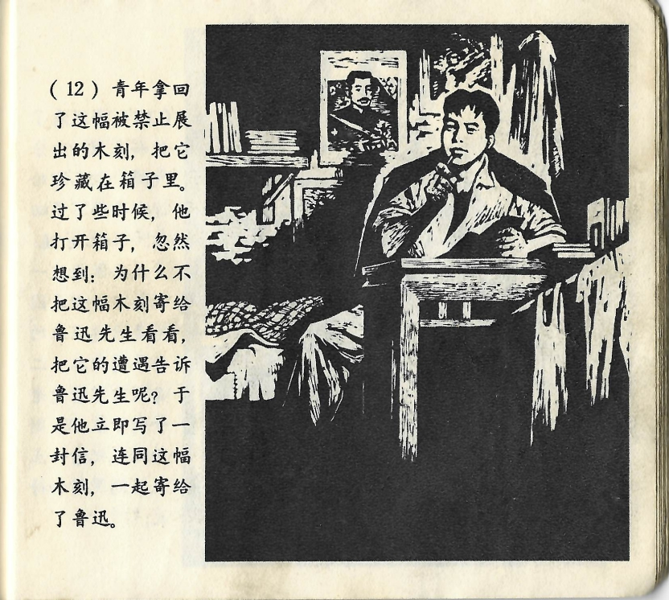



青年拿回了这幅被禁止展出的木刻，把它珍藏在箱子里。过了些时候，他打开箱子，忽然想到：为什么不把这幅木刻寄给鲁迅先生看看，把它的遭遇告诉鲁迅先生呢？于是他立即写了一封信，连同这幅木刻，一起寄给了鲁迅。

<--->

Der junge Mann hatte das von der Ausstellung verbannte Bild zurückgenommen und gut in einer Kiste versteckt. Nach einiger Zeit öffnete er die Kiste wieder und hatte plötzlich eine Idee: Warum sollte er das Bild nicht an Lu Xun schicken und ihm erzählen, was dem Bild widerfahren ist? Also schrieb er sofort einen Brief und schickte ihn gemeinsam mit dem Bild an Lu Xun.

