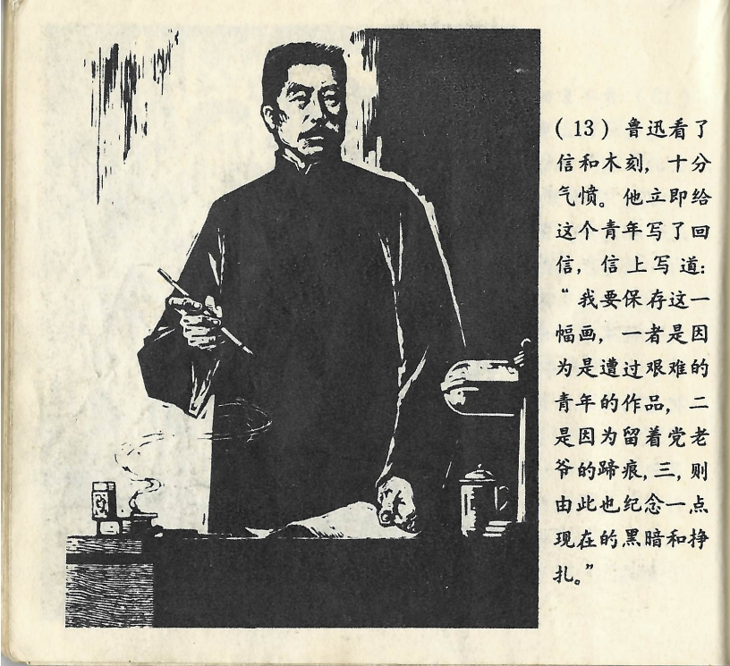



鲁迅看了信和木刻，十分气愤。他立即给这个青年写了回信，信上写道：“我要保存这一幅画，一者是因为是遭过艰难的青年的作品，二是因为留着党老爷的蹄痕，三，则由此也纪念一点现在的黑暗和挣扎。”

<--->

Als Lu Xun nun den Brief las und das Bild ansah, wurde er sehr wütend. Er verfasste sofort eine Antwort an den jungen Mann. Darin schrieb er: „Ich werde dieses Bild aufbewahren, erstens weil es das Werk eines jungen Mannes ist, der so viel erleiden musste, zweitens weil darauf die Inspekteure der Guomindang mit ihren Klauen Spuren hinterlassen haben und drittens auch zum Gedenken an die Dunkelheit und die Mühen der heutigen Zeit.“

