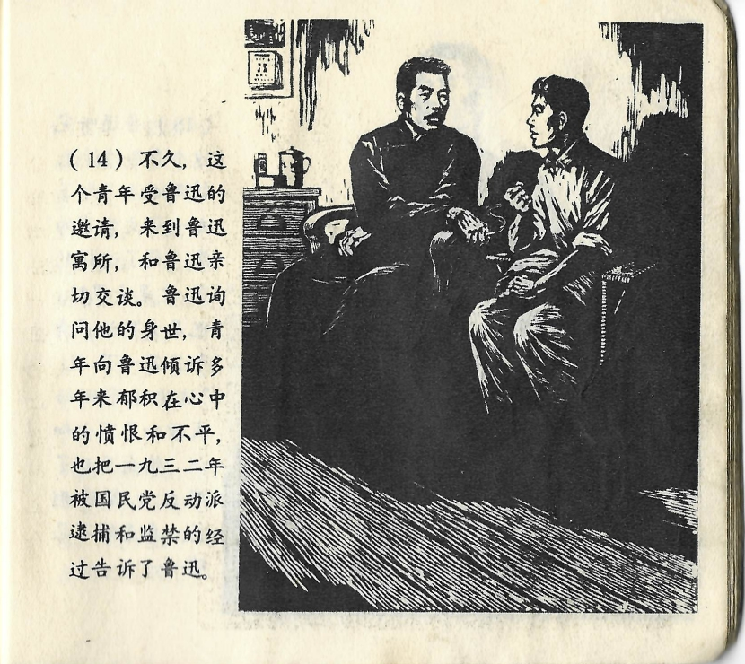



不久，这个青年受鲁迅的邀请，来到鲁迅寓所，和鲁迅亲切交谈。鲁迅询问他的身世，青年向鲁迅倾诉多年来郁积在心中的愤恨和不平，也把一九三二年被国民党反动派逮捕和监禁的经过告诉了鲁迅。

<--->

Nicht viel später erhielt der junge Mann Lu Xuns Einladung, ihn zu Hause zu besuchen und mit ihm ein persönliches Gespräch zu führen. Lu Xun fragte ihn zu seinem harten Los, und der junge Mann vertraute ihm die seit Jahren in ihm schwelende Verbitterung und seinen Kummer an, auch von der Festnahme und Inhaftierung durch die Reaktionäre der Guomindang im Jahr 1932 erzählte er Lu Xun.

