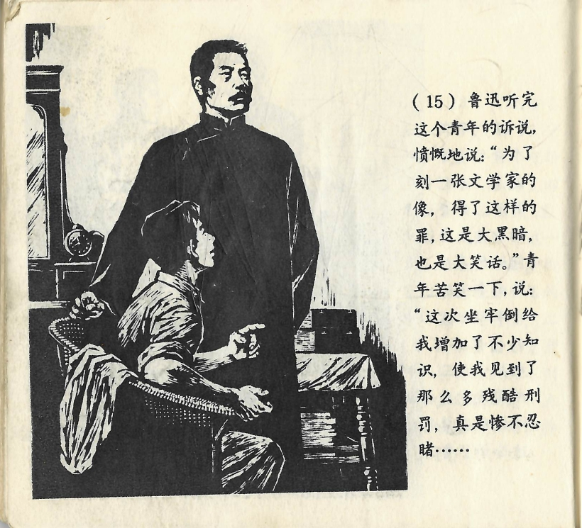



鲁迅听完这个青年的诉说，愤慨地说：“为了刻一张文学家的像，得了这样的罪，这是大黑暗，也是大笑话。”青年苦笑一下，说：“这次坐牢倒给我增加了不少知识，使我见到了那么多残酷刑罚，真是惨不忍睹……”

<--->

Als Lu Xun den Bericht des jungen Mannes angehört hatte, sagte er entrüstet: „Für das Schnitzen eines Schriftsteller-Porträts eine solche Strafe zu erhalten, das ist wirklich düster, aber auch total lächerlich.“ Der junge Mann lachte bitter auf und sagte: „Im Gefängnis habe ich unerwarteterweise vieles gelernt. Ich habe so viele brutale Strafen gesehen, es war wirklich nicht auszuhalten…“

