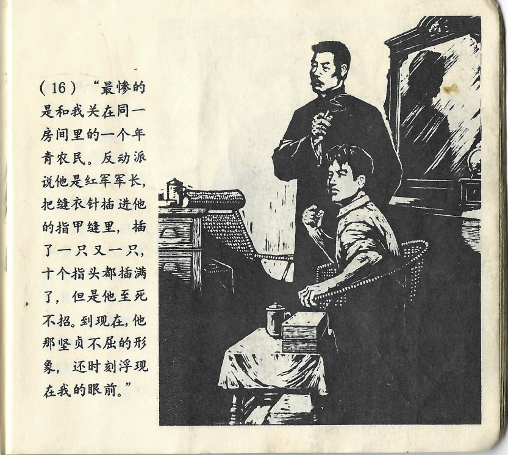



“最惨的是和我关在同一房间里的一个年青农民。反动派说他是红军军长，把缝衣针插进他的指甲缝里，插了一只又一只，十个指头都插满了，但是他至死不招。到现在，他那坚贞不屈的形象，还时刻浮现在我的眼前。”

<--->

„Am Schlimmsten erging es einem jungen Bauern, der mit mir in eine Zelle gesperrt war. Die Reaktionäre meinten, er wäre ein Offizier der Roten Armee, und so bohrten sie ihm Nähnadeln unter die Fingernägel, eine Nadel nach der anderen, an allen zehn Fingern, aber bis er starb, gab er kein Geständnis ab. Bis zum heutigen Tag ist mir sein entschlossener und unbeugsamer Ausdruck noch immer vor Augen.“

