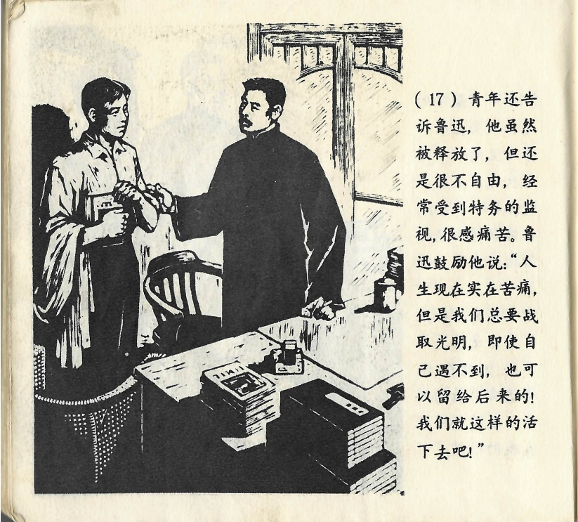



青年还告诉鲁迅，他虽然被释放了，但还是很不自由，经常受到特务的监视，很感痛苦。鲁迅鼓励他说：“人生现在实在苦痛，但是我们总要战取光明，即使自己遇不到，也可以留给后来的！我们就这样的\[sic\]活下去吧！”

<--->

Der Jugendliche erzählte Lu Xun außerdem noch, dass er, obwohl er freigelassen wurde, trotzdem nicht sehr frei war und häufig von Spitzeln einer Spezialeinheit überwacht wurde, was ihn sehr quälte. Lu Xun sagte ermunternd zu ihm: „Das Leben heutzutage ist in der Tat eine Qual. Dennoch sollten wir stets zuversichtlich bleiben, und auch wenn wir gewisse Dinge nicht erreichen können, so können wir sie jenen übertragen, die nach uns kommen werden. Lass uns nach dieser Maxime weiterleben!“

