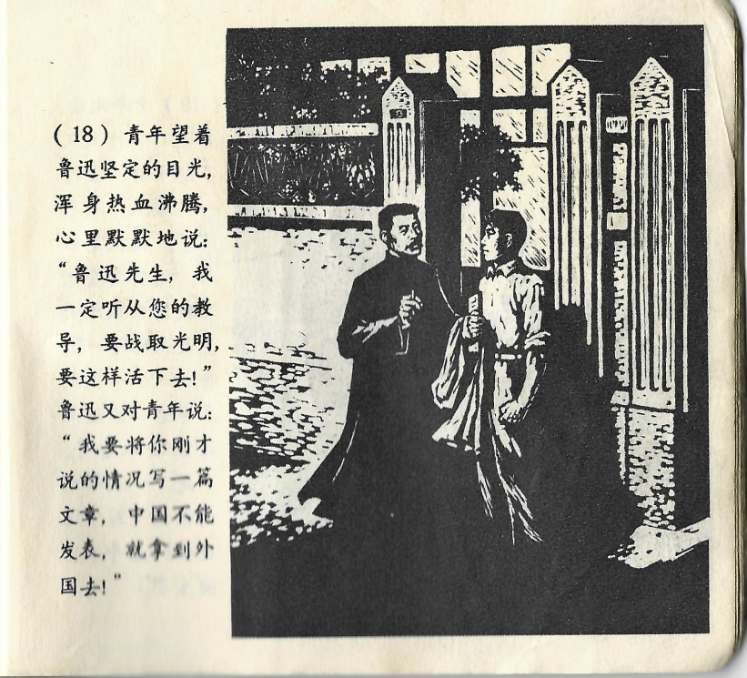



青年望着鲁迅坚定的目光，浑身热血沸腾，心里默默地说：“鲁迅先生，我一定听从您的教导，要战取光明，要这样活下去！”鲁迅又对青年说：“我要将你刚才说的情况写一篇文章，中国不能发表，就拿到外国去！”

<--->

Der junge Mann sah den entschlossenen Blick Lu Xuns, in ihm brodelte heißes Blut und innerlich sagte er zu ihm: „Werter Herr Lu Xun, ich werde Ihren Rat auf jeden Fall befolgen, zuversichtlich bleiben und genauso weiterleben!” Lu Xun wandte sich noch einmal an ihn und sagte: „Ich werde über alles, was du mir gerade erzählt hast, einen Artikel schreiben, und wenn er in China nicht erscheinen darf, dann eben im Ausland!“

