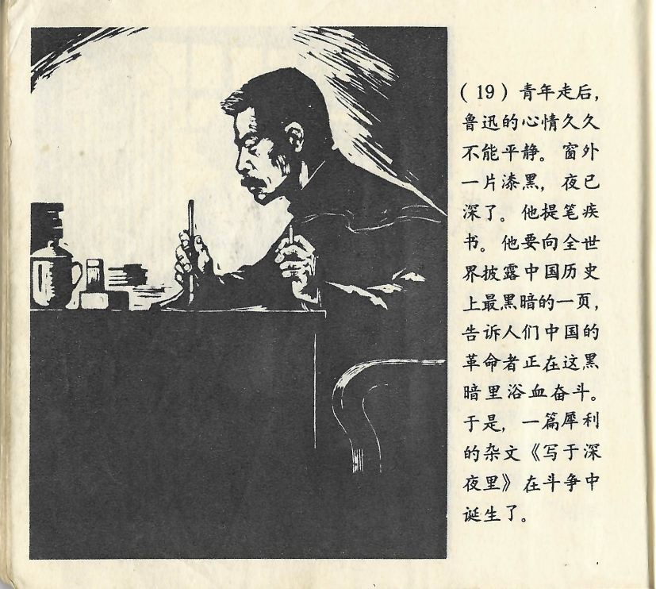



青年走后，鲁迅的心情久久不能平静。窗外一片漆黑，夜已深了。他提笔疾书。他要向全世界披露中国历史上最黑暗的一页，告诉人们中国的革命者正在这黑暗里浴血奋斗。于是，一篇犀利的杂文《写于深夜里》在斗争中诞生了。

<--->

Nachdem der junge Mann gegangen war, kam Lu Xun lange nicht zur Ruhe. Vor seinem Fenster war es stockdunkel, es war schon mitten in der Nacht. Er nahm einen Stift zur Hand und schrieb schnell. Er wollte für die ganze Welt eine der dunkelsten Seiten der Geschichte Chinas enthüllen und den Menschen erzählen, dass sich die chinesischen Revolutionäre in einem blutigen Kampf befanden. So wurde der scharfsinnige Essay mit dem Titel “In tiefer Nacht geschrieben” aus dem Kampf heraus geboren.

