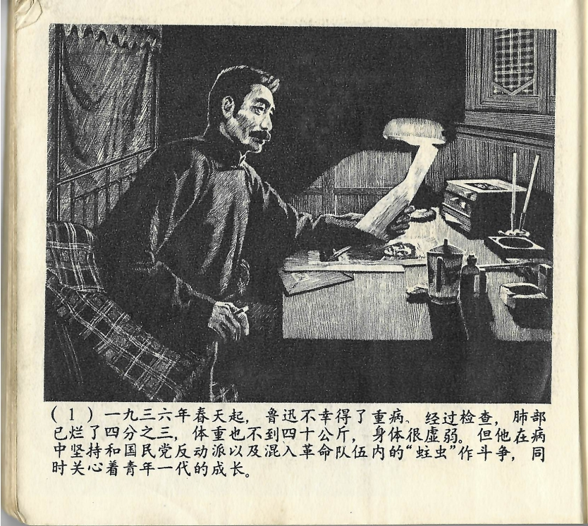



一九三六年春天起，鲁迅不幸得了重病，经过检查，肺部已烂了四分之三，体重也不到四十公斤，身体很虚弱。但他在病中坚持和国民党反动派以及混入革命队伍内的“蛀虫”作斗争，同时关心着青年一代的成长。

<--->

Seit dem Frühjahr des Jahres 1936 war Lu Xun leider schwer krank. Eine Untersuchung ergab, dass sein Lungengewebe bereits zu drei Vierteln zerstört war. Er wog keine 40 Kilogramm mehr und war sehr schwach. Doch trotz seiner Erkrankung kämpfte er weiter gegen die Reaktionäre der Guomindang und die „Schädlinge“, die in die revolutionären Truppen eigeschleust waren. Zugleich lag ihm die Entwicklung der jungen Generation am Herzen.

