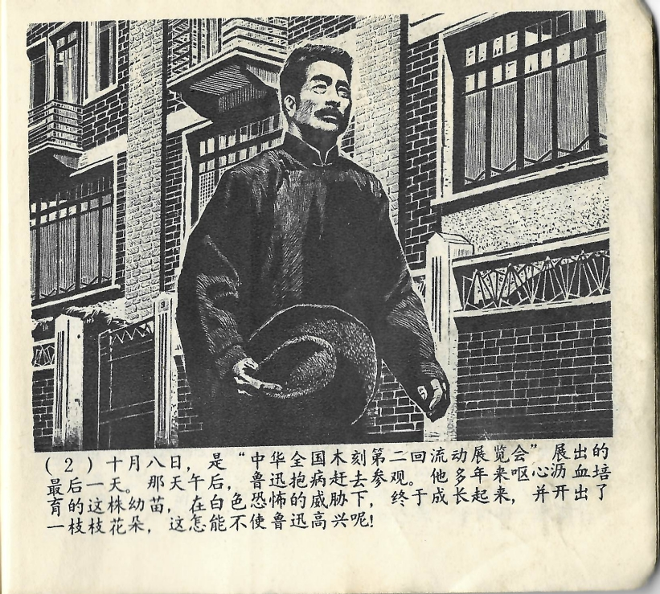



十月八日，是“中华全国木刻第二回流动展览会”展出的最后一天。那天午后，鲁迅抱病赶去参观。他多年来呕心沥血培育的这株幼苗，在白色恐怖的威胁下，终于成长起来，并开出了一枝枝花朵，这怎能不使鲁迅高兴呢！

<--->

Der 8. Oktober war der letzte Ausstellungstag der „2. Landesweiten Wanderausstellung für chinesische Holzschnitte“. Am Nachmittag machte sich der kranke Lu Xun daher zügig auf den Weg zur Ausstellung. Viele Jahre hatte er all seine Kraft darauf verwendet die Schösslinge auszubilden, und nun waren diese unter der Bedrohung durch den weißen Terror endlich herangewachsen und hatten selbst Blüten getrieben. Wie hätte dies Lu Xun nicht glücklich machen können!

