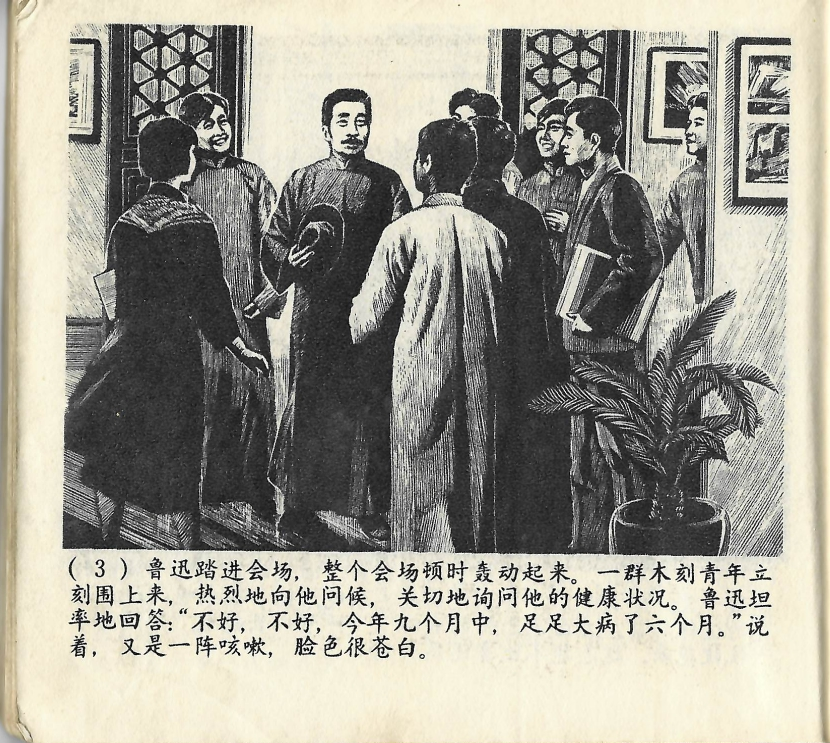



鲁迅踏进会场，整个会场顿时轰动起来。一群木刻青年立刻围上来，热烈地向他问候，关切地询问他的健康状况。鲁迅坦率地回答：“不好，不好，今年九个月中，足足大病了六个月。”说着，又是一阵咳嗽，脸色很苍白。

<--->

Als Lu Xun den Ausstellungssaal betrat, sorgte dies im ganzen Saal sofort für Aufsehen. Eine Gruppe junger Holzschnittkünstler gesellte sich sofort um ihn, grüßte ihn freundlich und fragte besorgt nach seinem Gesundheitszustand. Lu Xun antwortete geradeheraus: „Mir geht es nicht gut, wirklich nicht. Von neun Monaten war ich dieses Jahr ganze sechs Monate schwer krank.“ Als er das sagte, erlitt er einen weiteren Hustenanfall, und sein Gesicht war ganz blass. 

