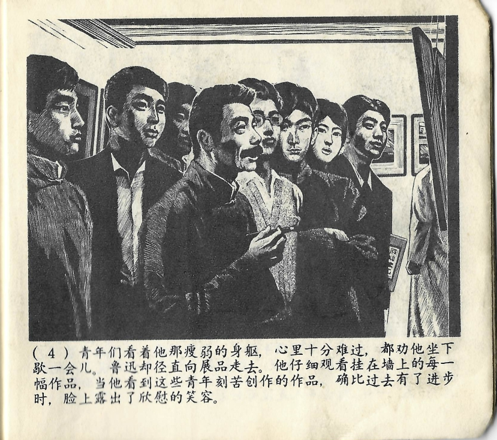



青年们看着他那瘦弱的身躯，心里十分难过，都劝他坐下歇一会儿。鲁迅却径直向展品走去。他仔细观看挂在墙上的每一幅作品，当他看到这些青年刻苦创作的作品，确比过去有了进步时，脸上露出了欣慰的笑容。

<--->

Lu Xuns schlechter Gesundheitszustand machte die jungen Leute ganz traurig. Sie drängten ihn sich hinzusetzen und sich eine Weile auszuruhen, doch Lu Xun ging geradewegs auf die Ausstellungsstücke zu. Er schaute sich jedes einzelne der Werke, die an der Wand hingen, genauestens an. Und als er die Werke sah, welche diese jungen Leute in mühsamer Arbeit erschaffen hatten, und feststellte, dass diese sich im Vergleich zu früher verbessert hatten, zeigte sich auf seinem Gesicht ein zufriedenes Lächeln.

