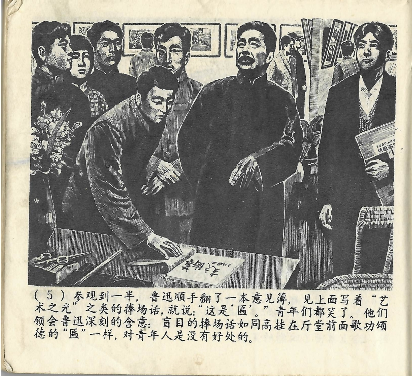



参观到一半，鲁迅顺手翻了一本意见簿，见上面写着“艺术之光”之类的捧场话，就说：“这是‘匾’。”青年们都笑了。他们领会鲁迅深刻的含意：盲目的捧场话如同高挂在厅堂前面歌功颂德的“匾”一样，对青年人是没有好处的。

<--->

Als er sich die Ausstellung zur Hälfte angesehen hatte, blätterte Lu Xun beiläufig in einem Gästebuch zur Ausstellung. Er sah, dass darin lobende Worte wie „Der Ruhm der Kunst“ und Ähnliches eingetragen waren und sagte: „Das ist doch eine ‚Schrifttafel‘.“ Die jungen Leute lachten. Sie verstanden die tiefere Bedeutung von Lu Xuns Worten: Genau wie die Lobhudeleien einer ‚Schrifttafel‘, die hoch über dem Eingang zu einer Halle hängt, hatte blindes Lob für die jungen Leute keinerlei Nutzen.

