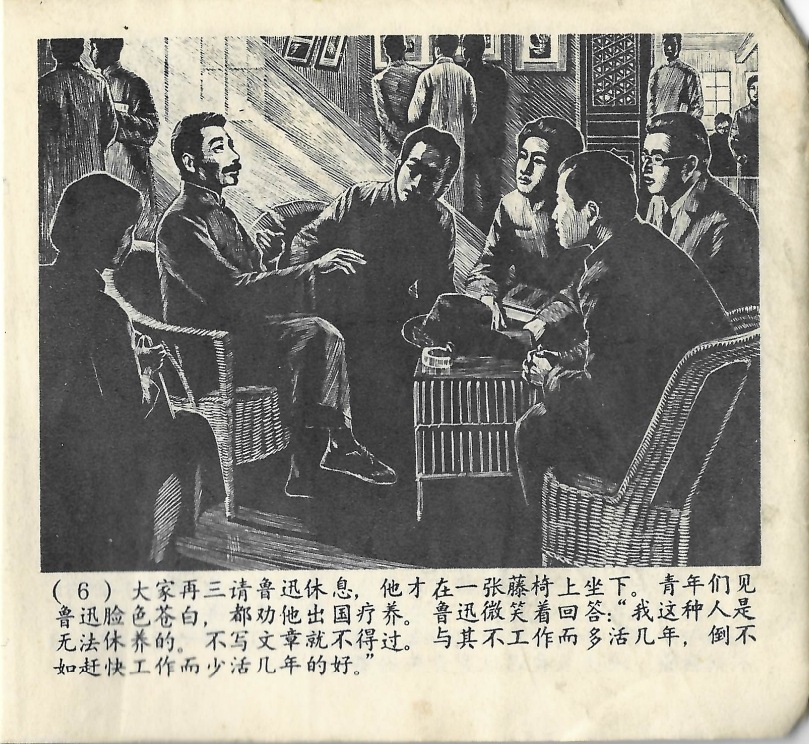



大家再三请鲁迅休息，他才在一张藤椅上坐下。青年们见鲁迅脸色苍白，都劝他出国疗养。鲁迅微笑着回答：“我这种人是无法休养的。不写文章就不得过。与其不工作而多活几年，倒不如赶快工作而少活几年的好。”

<--->

Erst als sie ihn wiederholt gebeten hatten sich doch etwas auszuruhen, setzte sich Lu Xun auf einen Rattanstuhl. Die jungen Leute sahen die Blässe in Lu Xuns Gesicht und drängten ihn, sich doch im Ausland auszukurieren. Lu Xun lächelte und sagte: „Leute wie ich können sich nicht erholen. Ich kann gar nicht anders als zu schreiben. Lieber nicht zu arbeiten und dafür ein paar Jahre länger zu leben, das ist nicht so gut, als bei der Arbeit keine Zeit zu verlieren und dafür einige Jahre weniger zu leben. 

