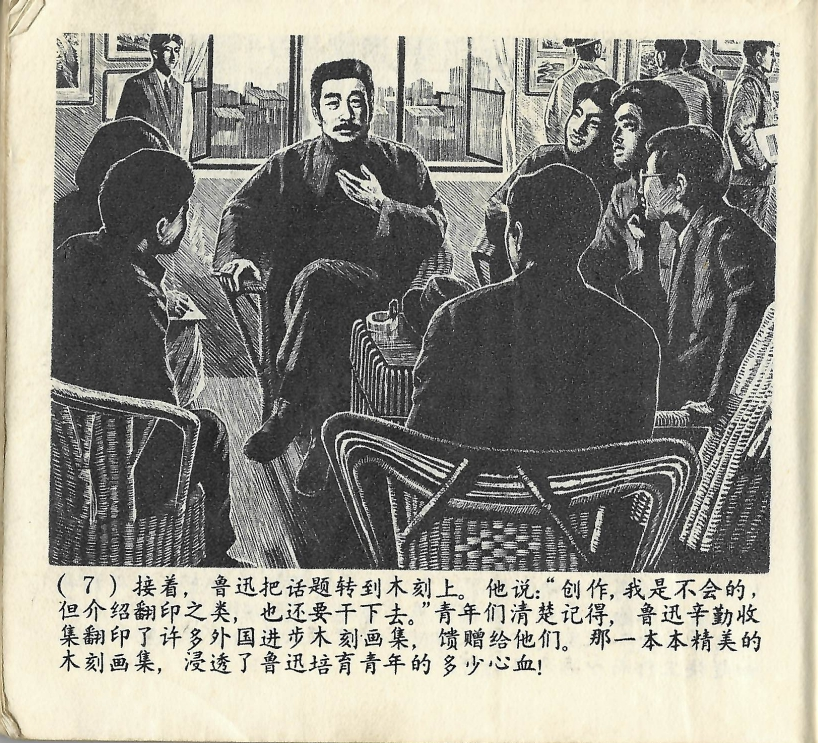



接着，鲁迅把话题转到木刻上。他说：“创作，我是不会的，但介绍翻印之类，也还要干下去。”青年们清楚记得，鲁迅辛勤收集翻印了许多外国进步木刻画集，馈赠给他们。那一本本精美的木刻画集，浸透了鲁迅培育青年的多少心血！

<--->

Anschließend wechselte Lu Xun das Thema zu den Holzschnitten. Er sagte: „Kunstwerke erschaffen, das kann ich nicht, aber ich werde weiter Nachdrucke und Ähnliches vorstellen.“ Die jungen Leute erinnerten sich noch genau daran, dass Lu Xun in mühsamer Arbeit viele fortschrittliche Holzschnittsammlungen aus dem Ausland zusammengetragen und nachgeduckt und ihnen diese dann geschenkt hatte. Jede dieser hochwertigen Holzschnittsammlungen war durchtränkt von Lu Xuns Herzblut zur Förderung der Jugend! 

