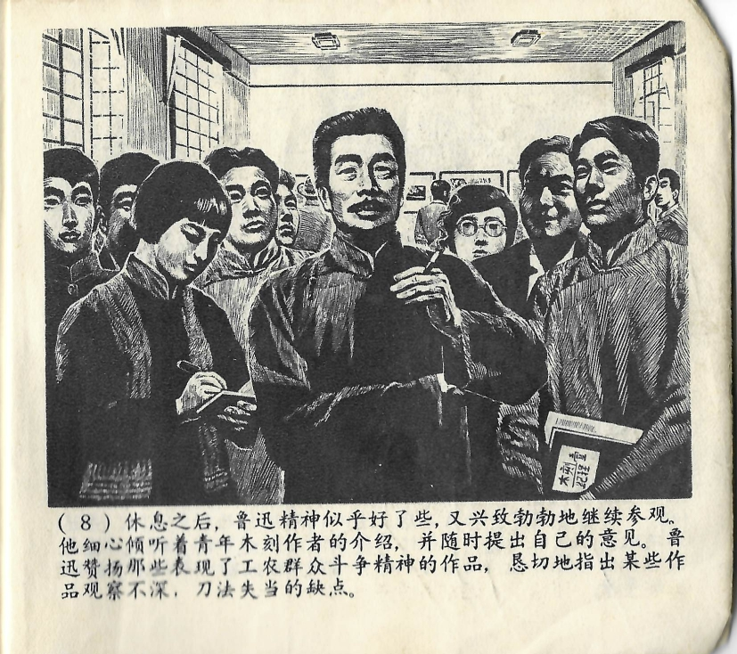



休息之后，鲁迅精神似乎好了些，又兴致勃勃地继续参观。他细心倾听着青年木刻作者的介绍，并随时提出自己的意见。鲁迅赞扬那些表现了工农群众斗争精神的作品，恳切地指出某些作品观察不深，刀法失当的缺点。

<--->

Nach der Pause ging es Lu Xun dem Anschein nach etwas besser und er setzte seinen Ausstellungsbesuch mit großer Begeisterung fort. Er hörte den Erklärungen der jungen Holzschnittkünstler aufmerksam zu und teilte ihnen immer wieder seine Ansichten dazu mit. Lu Xun lobte die Werke, die den Kampfgeist der Massen der Arbeiter und Bauern ausstrahlten, wies aber auch offen auf Mängel in einigen der Werke hin, wie etwa eine nur oberflächliche Beobachtungsgabe oder eine unzureichende Handfertigkeit beim Schnitzen. 

