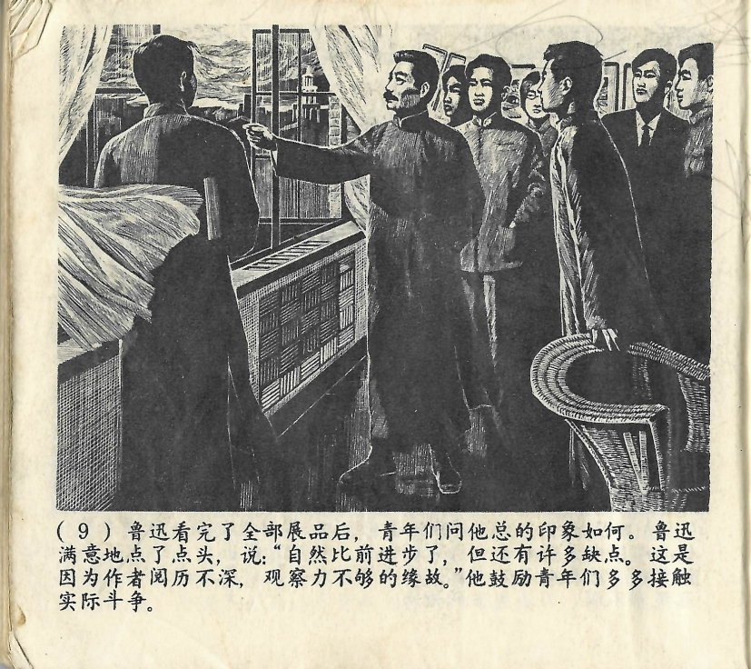



夜幕徐徐降临了，鲁迅这才和大家告别。青年们望着鲁迅渐渐远去的瘦弱身影，不禁想起他“横眉冷对千夫指，俯首甘为孺子牛”的著名诗句，想起他几十年的战斗历程。他们的眼眶湿润了。

<--->

Erst als langsam die Nacht hereinbrach, verabschiedete sich Lu Xun sich von allen. Und als die jungen Leute Lu Xuns schwacher und magerer Gestalt hinterherblickten, die sich nach und nach immer weiter entfernte, da mussten sie an einen berühmten Vers eines seiner Gedichte denken: „Mit grimmigem Blick biete ich tausend auf mich gerichteten Fingern die Stirn, mit gesenktem Kopf diene ich den Menschen“. Auch dachten sie an seinen jahrzehntelangen Kampf. Und ihre Augen waren voller Tränen.

