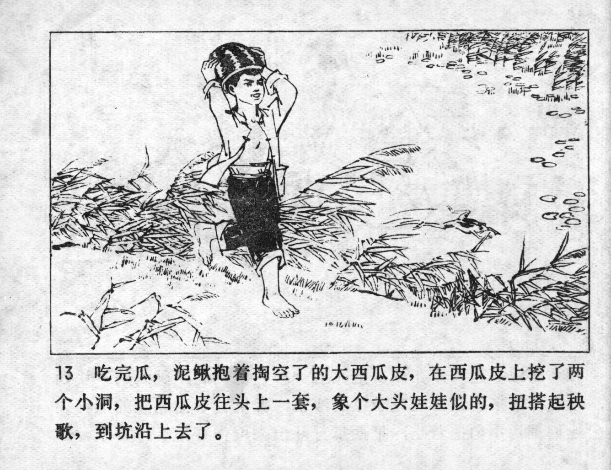



吃完瓜，泥鳅抱着掏空了的大西瓜皮，在西瓜皮上挖了两个小洞，把西瓜皮往头上一套，象个大头娃娃似的，扭搭起秧歌，到坑沿上去了。

<--->

After eating the melon, Niqiu held the hollowed-out watermelon skin, cut two small holes into it and put the watermelon peel on his head, so he looked like a big-headed doll. Dancing a Yangge, he went to the edge of the water pond.


