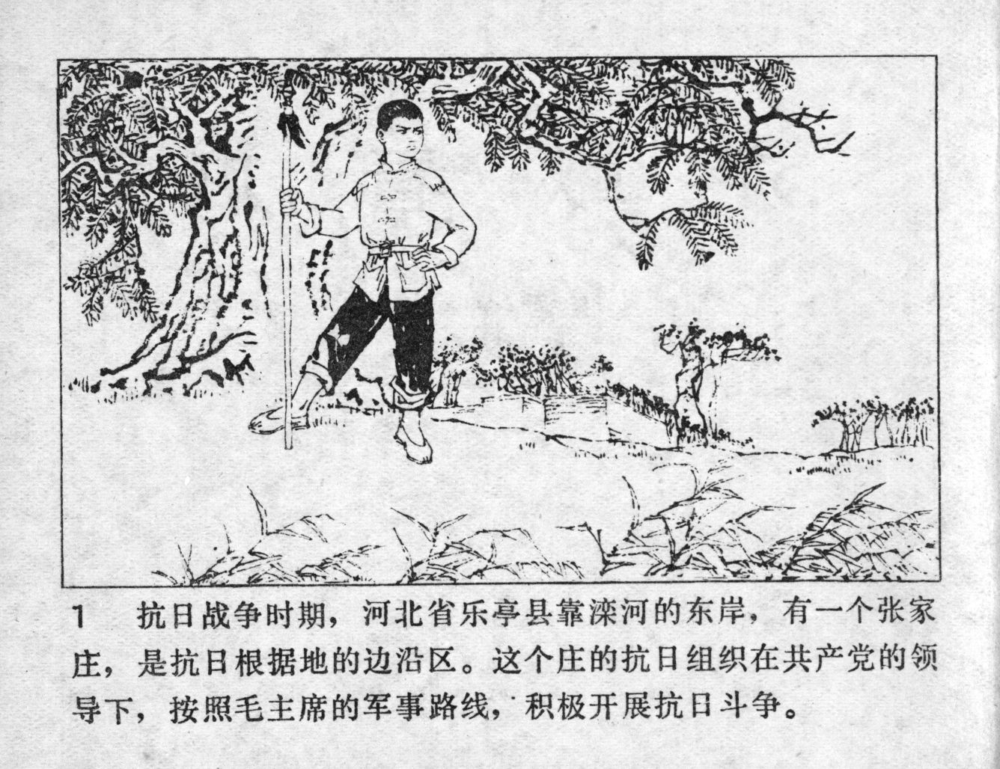



抗日战争时期，河北省乐亭县靠滦河的东岸，有一个张家庄，是抗日根据地的边沿区。这个庄的抗日组织在共产党的领导下，按照毛主席的军事路线，积极开展抗日斗争。

<--->

During the War of Resistance Against Japan, there was a place named Zhangjia Village, located on the east bank of the Luan River in Laoting County, which was in the border area of an anti-Japanese base. The village's anti-Japanese organization was under the leadership of the Communist Party and actively carried out the anti-Japanese struggle in accordance with Chairman Mao's military line.


