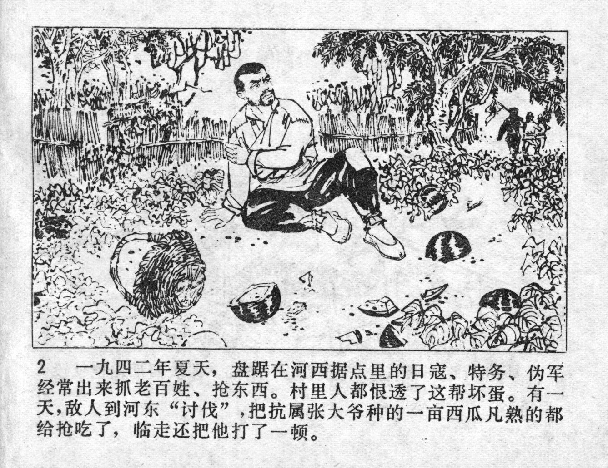



一九四二年夏天，盘踞在河西据点里的日寇，特务，伪军，经常出来抓老百姓，抢东西。村里人都恨透了这帮坏蛋。有一天，敌人到河东“讨伐”。把抗属张大爷种的一亩西瓜凡熟的都给抢吃了，临走还把他打了一顿。

<--->

In the summer of 1942, Japanese invaders, spies, and puppet soldiers were stationed on the west side of the Luan River and often came out to take captive civilians and steal their things. Everyone in the village detested these bastards. One day, the enemy arrived at the east side of the river to "punish" the locals. They robbed and ate all the ripe watermelons on the patch of Uncle Zhang, a military dependent. Before leaving, they even beat him up.


