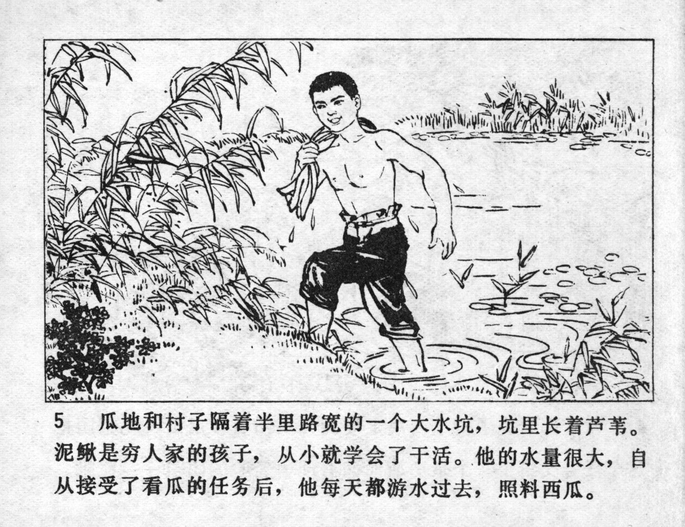



瓜地和村子隔着半里路宽的一个大水坑,坑里长着芦苇。泥鳅是穷人家的孩子，从小就学会了干活。他的水量很大，自从接受了看瓜的任务后，他每天都游水过去，照料西瓜。

<--->

The watermelon patch and the village were separated by a big water pond, half a mile wide with reeds growing inside. Niqiu came from a poor family and had learned to work hard since he was a small kid. He was a good swimmer, so after he had accepted responsibility to protect the melons, he swam over each day to tend to the watermelons.


