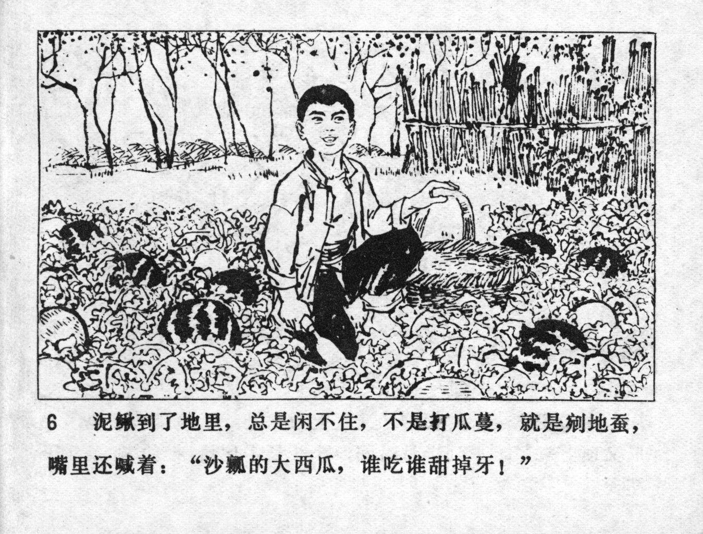



泥鳅到了地理，总是闲不住，不是打瓜蔓，就是剜地蚕，嘴里还喊着：“沙瓤的大西瓜，谁吃谁甜掉牙！”

<--->

At the patch, Niqiu always was busy. When he was not cutting the melon vines, he was picking out earthworms, all the while shouting: "A huge watermelon full of mushy pulp sweetens everyone's life!"


