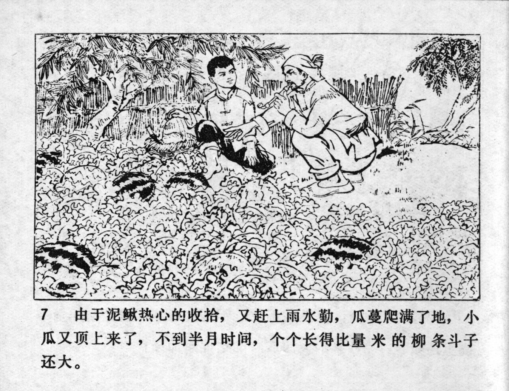



由于泥鳅热心的收拾，又赶上雨水勤，瓜蔓爬满了地，小瓜又顶上来了，不到半月时间，个个长得比量米的柳条斗子还大。

<--->

Because of Niqiu's enthusiastic work, and the frequent rainfalls, the melon vines crawled over the whole field and the small watermelons began to grow again. Before half a month had passed, they had all grown even bigger than Niqiu's wicker basket.


