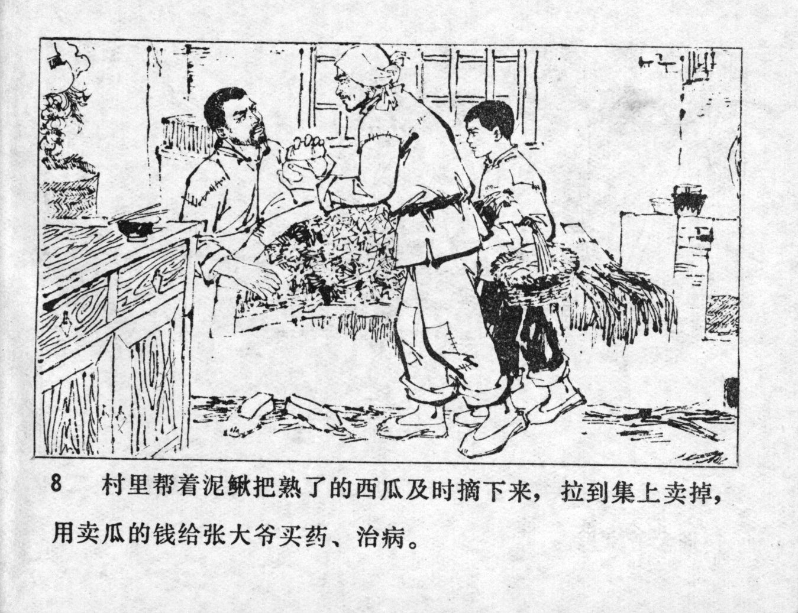



村里帮着泥鳅把熟了的西瓜及时摘下来，拉到集上卖掉，用卖瓜的钱给张大爷买药、治病。

<--->

The village people helped Niqiu pick the ripe watermelons in time and brought them to the market to sell them. With the money they earned, they bought medicine for Uncle Zhang and cured his injuries.


