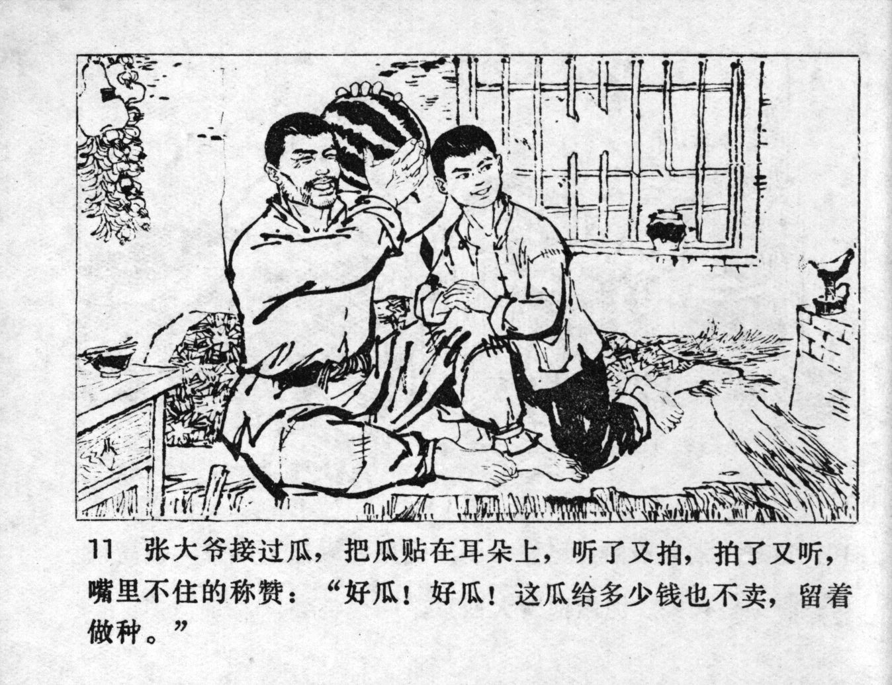



张大爷接过瓜，把瓜贴在耳朵上，听了又拍，拍了又听，嘴里不住称赞：“好瓜！好瓜！这瓜给多少钱也不卖，留着做种。”

<--->

After Uncle Zhang took the melon, he held it very close to his ear, listening and patting, patting and listening. He could not stop praising: "Such a good watermelon! Such a good watermelon! No matter how much money they give us, we're not selling this one. We keep it for making seeds."


