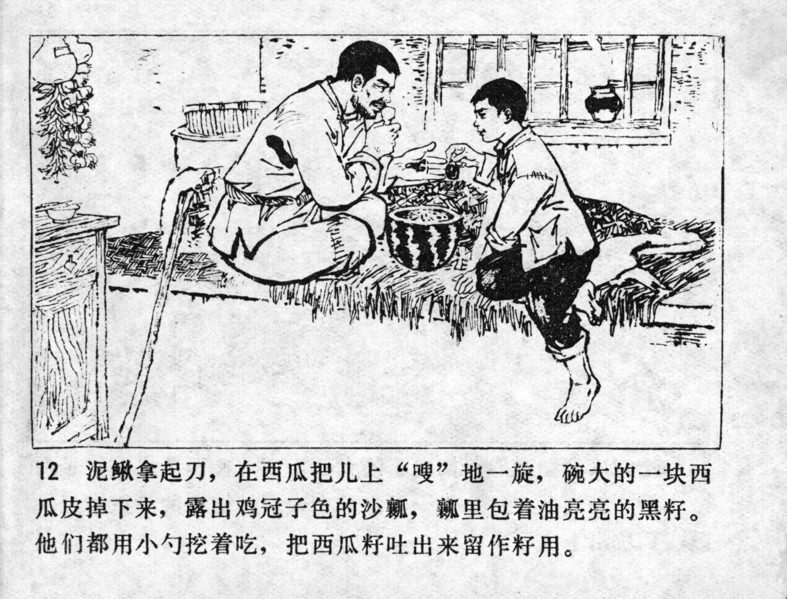



泥鳅拿起刀，在西瓜把儿上，“嗖” 地一旋，碗大的一块西瓜皮掉下来，露出鸡冠子色的沙瓤，瓤里包着油亮亮的黑籽。他们都用小勺挖着吃，把西瓜籽吐出来留作籽用。

<--->

Niqiu picked up a knife, and -- WHOOSH -- let it down on the watermelon. A large piece of the watermelon fell off and revealed the cockscomb-coloured melon pulp, which was covered with shiny black seeds. They both dug out some pulp with small spoons and ate it, spitting out the watermelon seeds in order to use them as seeds.


