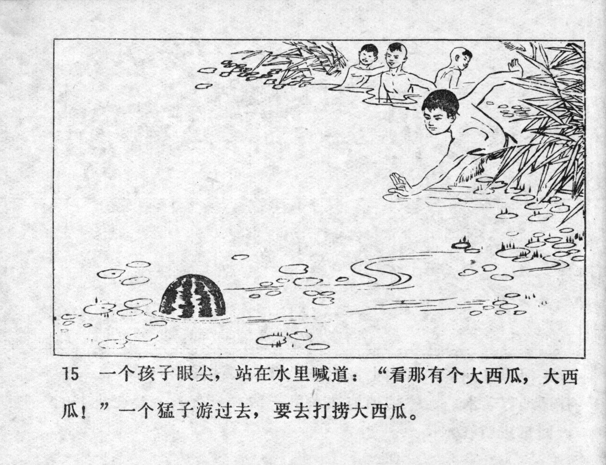



一个孩子眼尖，站在水里喊道：“看那有个大西瓜，大西瓜！”一个猛子游过去，要去打捞大西瓜。

<--->

One of the children had sharp eyes. He stood in the water and shouted: "Look, there's a huge watermelon, a huge watermelon!", a courageous child swam over to get the huge watermelon out of the water.


