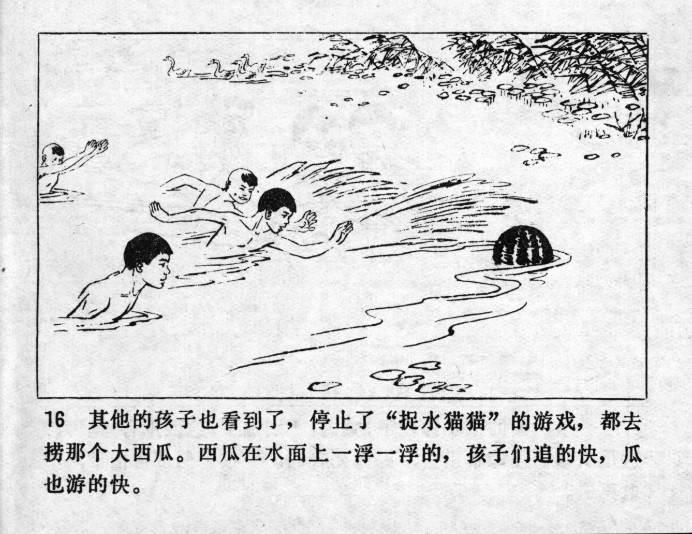



其他的孩子也看到了，停止了“捉水猫猫”的游戏，都去捞那个大西瓜。西瓜在水面上一浮一浮的，孩子们追的快，瓜也游的快。

<--->

Other children also saw it, so they stopped the game of "catch the water cat" and went to catch the huge watermelon. The watermelon was floating on the surface. As the children were chasing it fast, it was also swimming fast.


