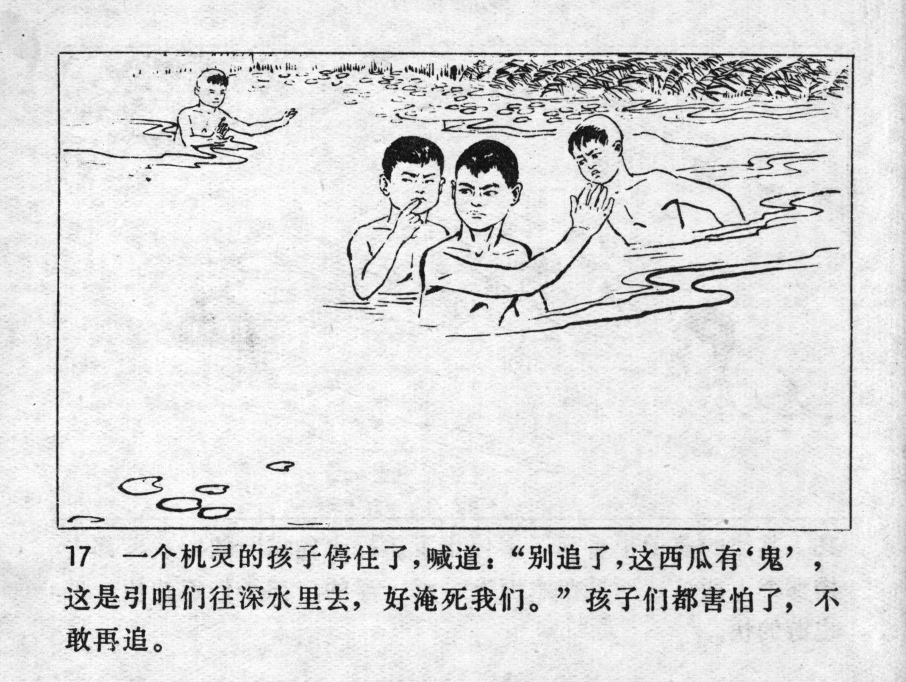



一个机灵的孩子停住了，喊道：“别追了，这西瓜有 \'鬼\'，这是引咱们往深水里去，好淹死我们。”孩子们都害怕了，不敢再追。

<--->

A clever child stopped and yelled: "Stop chasing, there's a ghost in this watermelon, it's leading us into the deep water to drown us." The children got scared and did not dare to continue their chase.


